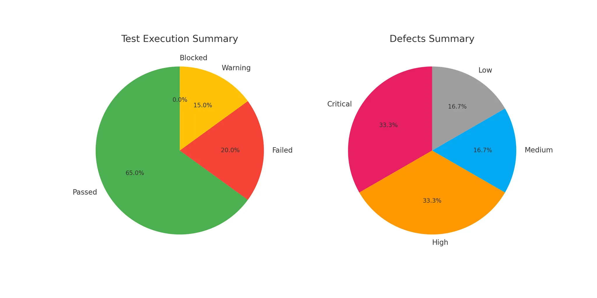

# Test Execution Summary

| **Total Test Cases** | **Passed** | **Failed** | **Warning** | **Blocked** |
|----------------------|------------|------------|-------------|-------------|
| 20                   | 13         | 4          | 3           | 0           |

## Defects Summary

| **Total Defects Found** | **Critical** | **High** | **Medium** | **Low** |
|-------------------------|--------------|----------|------------|---------|
| 6                       | 2            | 2        | 1          | 1       |

